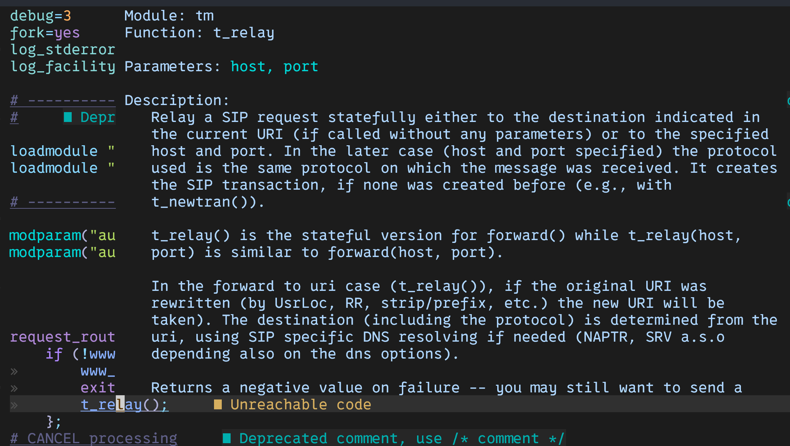

# Writing LSP for Kamailio.cfg - Part 1

In the previous post, i used the tree-sitter parser to parse the kamilio.cfg file for syntax highlighting. Since the tree-sitter also generates the go bindings for the parser, i thought it would be a good idea to use the parser to generate the LSP for the kamailio.cfg file.

For this reason i went back to the grammar i had written for the kamailio.cfg file and made it a bit more specific since that would help identifying the different nodes when im writing the LSP.

First and foremost, I am going to target Hover feature, I will look into more features as i go along. For this what i want from the LSP is to be able to hover over a token and get the information about the token. For now i'll consider only the function documentation.

## Name

I have named the LSP server as `KamaiZen`. The name is a play on the words Kamailio and Zen. The server is written in Go and uses the go bindings generated by the tree-sitter parser. Github repo for the project is [here](https://github.com/IbrahimShahzad/KamaiZen).

## Directory Structure


Following is the directory structure i have for the project:

```
.
├── README.md
├── kamailio_cfg
│   ├── binding.go
│   ├── binding_test.go
│   ├── parser.c
│   └── treesitter
│       ├── alloc.h
│       ├── array.h
│       └── parser.c
├── lsp
│   ├── initialize.go
│   ├── message.go
│   ├── textDocument.go
│   ├── textDocument_open.go
│   ├── textDocument_hover.go
│   └── writer.go
├── docs
│   └── server.go
├── analysis
│   ├── analysis.go
│   ├── formatter.go
│   └── state.go
├── rpc
│   └── rpc.go
└── utils
    └── logger.go
    
```

### kamailio_cfg

This directory contains the go bindings for the tree-sitter parser. Main two files to consider are `binding.go` and `parser.c`.

- The `parser.c` file is the file generated by the tree-sitter parser. 
- The `binding.go` file contains the go bindings for the parser. 

### rpc

This directory contains the rpc server. The main file to consider is `rpc.go`.

- The `rpc.go` file contains the Encode Decode functions for the messages that are sent and received by the LSP server.

### lsp

This directory contains the LSP server. The main files to consider are `initialize.go`, `message.go`, `textDocument.go`, `textDocument_open.go`, `textDocument_hover.go` and `writer.go`.

- The `initialize.go` file contains the initialize function for the LSP server.
- The `message.go` file contains the message struct for the LSP server.
- The `textDocument.go` file contains the textDocument struct for the LSP server.
- The `textDocument_open.go` file contains the open function for the LSP server.
- The `textDocument_hover.go` file contains the hover function for the LSP server.
- The `writer.go` file contains the writer function for the LSP server.

### analysis

This directory will contain the analysis done on the source code. It will be able to proide the user with diagnostics and code completion.

### docs

This is the directory where the documentation for the `kamailio` functions/modules will be parsed and stored and on hover the information will be displayed. We will focus on this one in this post.

## Let's get started

- You can watch youtube video [Learn By Building: Language Server Protocol](https://www.youtube.com/watch?v=YsdlcQoHqPY) by [TJ DeVries](https://www.youtube.com/@teej_dv) to get a better understanding of how to write an LSP server. I found it very helpful starting out on this.

- I'll skip straight to parsing the kamailio docs and the hover feature.


### Parsing the Kamailio Docs

For parsing the kamailio docs, I have gone with the README files present in each modules directory, and as stated earlier im focusing on the function definitions for now.

I have following structure for the docs:

```go
var moduleDocsCache = make(map[string]ModuleDocs)

type FunctionDoc struct {
	Name        string
	Parameters  string
	Description string
	Example     string
}

type FunctionDocs struct {
	Functions map[string]FunctionDoc
}

type ModuleDocs struct {
	Functions map[string]FunctionDocs
}
```

1. `FunctionDoc` contains the name of the function, the parameters, the description and an example.
2. `FunctionDocs` contains a map of `FunctionDoc` with the key as the function name.
3. `ModuleDocs` contains a map of `FunctionDocs` with the key as the module name.

The idea is that on startup the LSP server will parse the README files and store the information in the `moduleDocsCache` map. When a hover request is made, the server will look up the function in the cache and return the information.

The function is called on startup and is as follows:

```go
func Initialise(s settings.LSPSettings) {
	path := s.KamailioSourcePath() + "/src/modules"
	listOfModules, err := os.ReadDir(path)
	if err != nil {
		fmt.Println("Error reading directory")
		return
	}
	// Get All Modules
	for _, module := range listOfModules {
		// Parse README file for each module
		readme, err := os.ReadFile(path + "/" + module.Name() + "/README")
		if err != nil {
			fmt.Println("Error reading file")
			return
		}

		moduleDocs := NewModuleDocs()
		functionDocs := extractFunctionDoc(strings.Split(string(readme), "\n"))
		functionDocsMap := FunctionDocs{Functions: make(map[string]FunctionDoc)}
		for _, functionDoc := range functionDocs {
			functionDocsMap.AddFunctionDoc(functionDoc)
		}
		moduleDocs.AddFunctionDoc(module.Name(), functionDocsMap)
		moduleDocsCache[module.Name()] = moduleDocs
	}
}
```

The main function responsible for extracting the documentation is  `extractFunctionDoc` which is as follows:

```go
func extractFunctionDoc(lines []string) []FunctionDoc {
	funcPattern := regexp.MustCompile(`^\s*\d+\.\d+\.\s*(\w+)\((.*)\)\s*$`)
	var functionDocs []FunctionDoc
	var functionDoc FunctionDoc
	var inExample bool
	var example string
	var exampleLineCount int
	for _, line := range lines {
		if match := funcPattern.FindStringSubmatch(line); match != nil {
			if functionDoc.Name != "" {
				functionDocs = append(functionDocs, functionDoc)
			}
			functionDoc = FunctionDoc{Name: match[1], Parameters: match[2]}
			inExample = false
			example = ""
		} else if functionDoc.Name != "" {
			if !inExample {
				// example has indentation of some spaces
				if strings.Contains(line, "Example") {
					inExample = true
				} else {
					functionDoc.Description += line + "\n"
				}
			} else {
				if strings.Contains(line, "...") {
					exampleLineCount++
					// end of example if there are 2 lines
					if exampleLineCount == 2 {
						inExample = false
					}
					functionDoc.Example = example
				} else {
					example += line + "\n"
				}
			}
		}
	}
	if functionDoc.Name != "" {
		functionDocs = append(functionDocs, functionDoc)
	}
	return functionDocs
}
```

The function uses a regular expression to match the function definition and then extracts the parameters and the description. The function also extracts the example if it is present.

### Hover Feature

The hover feature request and response are defined in the `textDocument_hover.go` file.

```go
type HoverRequest struct {
	Request
	Params HoverParams `json:"params"`
}

type HoverParams struct {
	TextDocuemntPositionParams
}

type HoverResponse struct {
	Response
	Result *Hover `json:"result"`
}

type Hover struct {
	Contents MarkupContent `json:"contents"`
	Range    *Range        `json:"range,omitempty"`
}

func NewHoverResponse(id int, contents string) HoverResponse {
	return HoverResponse{
		Response: Response{
			RPC: "2.0",
			ID:  id,
		},
		Result: &Hover{
			Contents: MarkupContent{
				Kind:  "markdown",
				Value: contents,
			},
		},
	}
}
```

When a hover request is made, the following block of code is executed:

```go
func handleMessage(writer io.Writer, logger *log.Logger, state analysis.State, method string, contents []byte, analyser_channel chan analysis.State) {
	logger.Println("Received message with method: ", method)
	switch method {

	case MethodInitialize:
        ...

	case MethodDidOpen:
		...

    case MethodHover:
		var request lsp.HoverRequest
		if error := json.Unmarshal(contents, &request); error != nil {
			logger.Println("Error unmarshalling hover request: ", error)
			return
		}
		logger.Println("Hover request for document with URI: ", request.Params.TextDocument.URI)
		response := state.Hover(request.ID, request.Params.TextDocument.URI, request.Params.Position)
		logger.Printf("Sent hover response %v", response)
		lsp.WriteResponse(writer, response)

	case MethodDidChange:
        ...
	case MethodDefinition:
        ...
	case MethodFormatting:
        ...
	}
}

```

The `Hover` method is called on the `state` object which is responsible for returning the hover response.

```go
type State struct {
	// Key: URI, Value: Text content
	Documents map[lsp.DocumentURI]string
}

func (s *State) Hover(id int, uri lsp.DocumentURI, position lsp.Position) lsp.HoverResponse {
	text := s.Documents[uri]
	functionName := GetFunctionNameAtPosition(uri, position, []byte(text))
	documentation := docs.FindFunctionInAllModules(functionName)
	return lsp.NewHoverResponse(id, fmt.Sprintf("%s", documentation))
}
```

Here the `State` is a map of `URI` to `Text content`. The `Hover` method gets the text content for the URI and then gets the function name at the position. The function name is then used to get the documentation from the `moduleDocsCache` map.


### GetFunctionNameAtPosition

```go
func GetFunctionNameAtPosition(uri lsp.DocumentURI, position lsp.Position, source_code []byte) string {
	node := stateTreeCache.nodes[uri]
	return getFunctionName(node, position, source_code)
}

func getFunctionName(node *sitter.Node, position lsp.Position, source_code []byte) string {
	nodeAtPosition := node.NamedDescendantForPointRange(
		sitter.Point{
			Row:    uint32(position.Line),
			Column: uint32(position.Character),
		},
		sitter.Point{
			Row:    uint32(position.Line),
			Column: uint32(position.Character),
		})
	functionName := nodeAtPosition.Content(source_code)
	return functionName
}
```

Here we use out `stateTreeCache` to get the node at the position and then get the content of the node which is the function name. This cache is populated when the document is opened. This is simply a map of `URI` to `Node`. The `Node` here represents the go-tree-sitter node. So the tree is going to be exactly like what we used in the parser for syntax highlighting.

### FindFunctionInAllModules

```go
func FindFunctionInAllModules(functionName string) string {
	for moduleName, moduleDocs := range moduleDocsCache {
		if _, exists := moduleDocs.Functions[moduleName].Functions[functionName]; exists {
			return "Module: " + moduleName + "\n" + moduleDocs.GetFunctionDocAsString(moduleName, functionName)
		}
	}
	return "Function not found"
}
```

This function iterates over the `moduleDocsCache` map and checks if the function exists in any of the modules. If it does, it returns the documentation for the function. The cache is populated on startup.

### StateTreeCache

The `StateTreeCache` is populated when the document is opened. The `Open` method is called when a document is opened.

```go
type Parser struct {
	parser   *sitter.Parser
	language *sitter.Language
	tree     *sitter.Tree
}

func NewParser() *Parser {
	return &Parser{
		parser: sitter.NewParser(),
	}
}

func (p *Parser) SetLanguage() {
	p.language = sitter.NewLanguage(kamailio_cfg.Language())
	p.parser.SetLanguage(p.language)
}

func (p *Parser) GetLanguage() *sitter.Language {
	return p.language
}

func (p *Parser) Parse(sourceCode []byte) *sitter.Node {
	tree, _ := p.parser.ParseCtx(context.Background(), nil, sourceCode)
	p.tree = tree
	n := p.tree.RootNode()
	return n
}

func (p *Parser) GetTree() *sitter.Tree {
	return p.tree
}

func (p *Parser) UpdateTree(content []byte) {
	newTree, _ := p.parser.ParseCtx(context.Background(), p.tree, content)
	p.tree = newTree
}
type StateTree struct {
    nodes map[lsp.DocumentURI]*sitter.Node
}

// module level state tree
var stateTreeCache StateTree

func NewStateTree() StateTree {
    return StateTree{
        nodes: make(map[lsp.DocumentURI]*sitter.Node),
    }
}

func (s *StateTree) AddNode(uri lsp.DocumentURI, node *sitter.Node) {
    s.nodes[uri] = node
}

func StartAnalyser(c <-chan State, writer io.Writer, logger *log.Logger, wg *sync.WaitGroup) {
    defer wg.Done()
    parser := NewParser()
    parser.SetLanguage()
    stateTree := NewStateTree()
    logger.Println("=====Analyser started")

    for {
        select {
        case state, ok := <-c:
            if !ok {
                logger.Println("Channel closed! Exiting...")
                return
            }
            for uri, content := range state.Documents {
                node := parser.Parse([]byte(content))
                //...
                stateTreeCache = stateTree
            }
        }
    }
}
```

The Parser uses the kamailio_cfg language parser, this is the same parser that was used for syntax highlighting. The `StateTree` is a map of `URI` to `Node`. The `Node` is the go-tree-sitter node. The `StartAnalyser` function is responsible for populating the `StateTreeCache` when the document is opened.

We use this same cache to get the node at the position when the hover request is made.

### In Action

The hover feature in action:




## Conclusion

I still have yet to update the design of the LSP server and add more features. I will be looking into the diagnostics and code completion after i have fine-tuned this.

Also in terms of design, i will be looking into the `golang.org/x/tools/internal/lsp` package to see how they have implemented the LSP server.

I will be updating the github repo with the latest changes. You can find the repo [here](https://github.com/IbrahimShahzad/KamaiZen).

